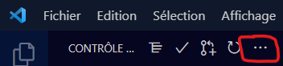

# Bienvenue sur le projet SAE 1.05 Recueil de besoins - Groupe 1D

## Setup VsCode :

- Installez git si c'est pas déjà fait  https://git-scm.com/download/win + Redémarrez votre PC et allumez VsCode
- CTRL + Maj + G (L'onglet contrôle de code source dans la barre latérale de gauche)
- Cliquez sur "Cloner"
- Dans la barre en haut qui s'affiche, coller ce texte et valider avec entrée : `https://gitlabiut.iutlan.univ-rennes1.fr/etuinfo/2022sae105/2022sae105_1d/sae105_d23.git` 
- Sélectionnez le dossier où vous voulez que le repo soit installé localement (pour faire vos modifs) (ne créez pas un dossier spécifique, git va automatiquement créer un dossier avec le nom du repo et mettre tout dedans)
- (Si première connexion) Une fenêtre de connexion Windows devrait s'afficher : entrez vos noms d'utilisateurs et mdp de gitlab (en gros les mêmes que ceux que vous avez pour les pc de l'IUT)
- Une fois que c'est fait, le repo devrait se cloner et une fenêtre vous demandans si vous voulez l'ouvrir devrait s'afficher (sinon réessayez, et si vous y arrivez toujours pas mp moi)

## Pour soumettre des changements

- CTRL + Maj + G (L'onglet contrôle de code source dans la barre latérale de gauche)
- Pour la première fois ou si on a merge votre branche : Appuyez sur les trois petits points en haut de la barre latérale, et allez dans "Branche" -> "Créer une branche" et nommez la avec votre nom prénom ou jsp moi 

- Comparez vos changements si vous le souhaitez (double clic sur les noms des fichiers qui apparaissent dans la barre à gauche de votre écran)
- Appuyez sur le + pour chaque fichier que vous souhaitez soummettre (vous êtes pas obligé de tout mettre, par exemple si il y a un fichier où tout est pas fini mais que il y en a d'autres où on en a besoin)
- Appuyez sur la flèche à côté de commit et cliquez sur "Commit & Push"
- Dans le fichier qui s'ouvre, mettez les commentaires de ce que vous venez de faire (description brève mais pas trop)
- Sauvegardez (CTRL + S) et fermez ce fichier, les changements devrait alors être push

## Si on a merge votre branche avec la principale
- Dans VScode, CTRL + Maj + G (bon vous savez hein)
- Les 3 petits points -> "Checkout to" (ou jsp ce qu'il y a marqué en fr, en dessous de clone en gros)
- Cliquez sur "master" dans le truc qui s'affiche (pas le origin/master, juste le master)
- Le code devrait revenir à un truc ancien, c normal
- Recliquez sur les 3 petits points -> "Delete Branch"
- Sélectionnez le nom de votre branche que vous avez créez
- Une fois que c fait, recliquez encore une fois sur les 3 petits points et cliquez sur "Pull"
- Voilà normalement c bon, vous avez les derniers changements mis en commun (avec les votres aussi normalement)
- **IMPORTANT** : n'oubliez pas de recréer une nouvelle branche où vous ferez vos modifications (quand vous allez commit)
